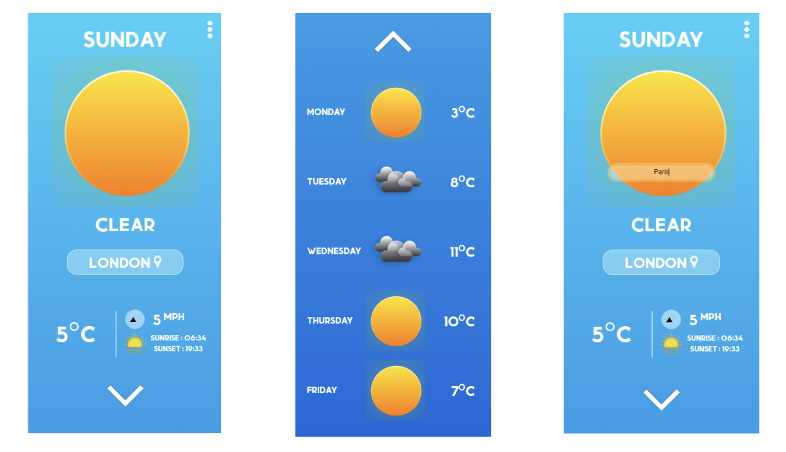

# weatherApp

Screen Shot of application:

Technologies needed:
1) Code editor (eg. Visual Studio Code)
2) Extension to run program (eg. Code Runner or similar)

To Run program:
1) Enter package.json
2) 2) Run File

This can als be done in the terminal, the virtual environment simply offers a UI.
